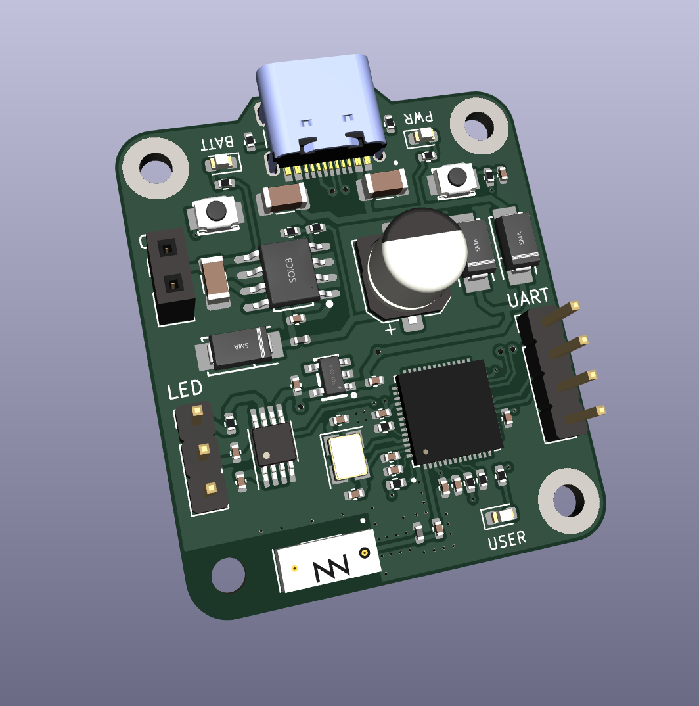

# Delta

<p align="middle">
    
    
</p>

Delta is a minature, custom board that remotely control vehicles, connecting to the Onboard Diagnostics (OBD-II) port and streaming real-time onboard sensor data such as:

- Speed
- Acceleration
- Gyroscopic Tilt
- Throttle & Steering Position
- Gear
- Engine RPM

and integrating external cameras and sensors.

Delta supports WiFi and Bluetooth LE, running a dual-core ESP32-S3R8V based on the 32-bit Xtensa architecture. The current prototype is only 32mm * 37mm with single-sided assembly, packing a ton of components into an incredibly small area. Delta can be powered by a computer through the USB Type-C port or independantly with a 12v car battery.

## Project Structure

```
.
├── docs        : Project documentation
├── firmware    : Delta firmware
├── iot         : AWS IoT infrastructure
├── pcb         : KiCad PCB design files
└── README.md
```

## Hardware

Features:
- USB Type-C connector
- 12v -> 5v @ 3A Buck Converter
- 5v -> 3.3v @ 700mA Low Dropout Regulator
- Dual Core ESP32-S3R8V microcontroller
    - Ultra-low current deep sleep
- 2.4GHz 802.11/b/g/n WiFi
- Bluetooth Low Energy
- CAN bus communication
- Neopixel support
